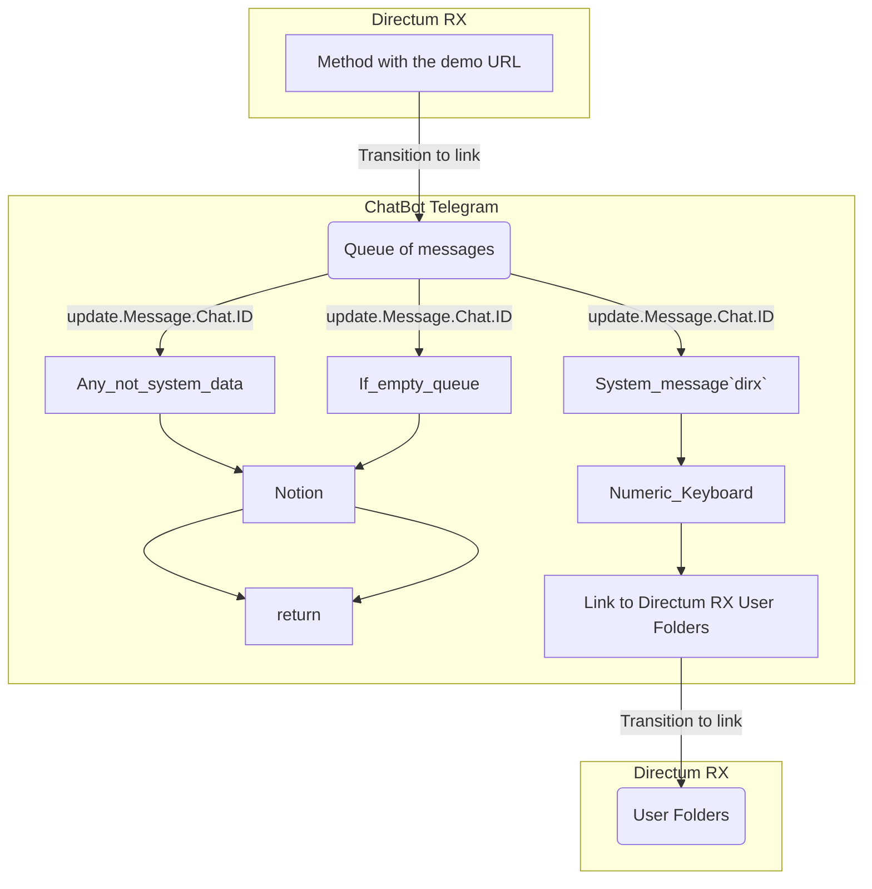

## Demo packet of chatbot Telegram for Directum RX  

### Описание. Description  
Демонстрационный модуль передачи `rest`-данных из СЭД `Directum RX` в чат-бот `Telegram`.  
При получении определенных данных, можно перейти по гиперссылке, через клик на кнопке клавиатуры чата, 
к нужному документу в Проводнике `Directum RX`.  

В демо пакете токен авторизации для одного пользователя хранится явно в конфиге.    
В полной версии токены пользователей хранятся в БД.  

В `Directum RX` создано демо Решение включающее справочник с фиксированными `rest`-запросами,  
при переходе по такой гиперссылке отправляется запрос в модуль обмена с чат-ботом `Telegram`.  

### Сборка локально и в Yandex Cloud. Build local and to Yandex Cloud  
#### Локально. Local:  
	docker build -t dirx2telegabot -f Dockerfile  
	
#### Облако. Cloud.  
	sudo docker build . -t cr.yandex/${REGISTRY_ID}/debian:dirx2telegabot -f Dockerfile

### Тестирование локально и в Yandex Cloud. Testing local and to Yandex Cloud      
#### Локально. Local:    
	docker run --name dirx2telegabot -p 8077:8077 -d dirx2telegabot
	curl localhost:8077/Уведомление  

#### Облако. Cloud.  
	sudo docker run --name dirx2telegabot -p 8077:8077 -d cr.yandex/${REGISTRY_ID}/debian:dirx2telegabot  
	curl external_address_vm:8077/Уведомление
	

### Использование. How use  
По клику на сформированной демо-ссылке в `Directum RX`, отправляется `rest`-сообщение к `http`-серверу чат-бота.  
Пользователь может в любой момент ввести сообщение запроса данных `dirx` в своем чат-боте `Telegram`.  
При вводе ключа `dirx` выводится демо клавиатура чат-бота для взаимодействия с СЭД `Directum RX`. 
Если данных из `Directum RX` нет, видим сообщение `Очередь Directum RX пуста`.  
При вводе произвольных данных, видим сообщение `Введите: dirx"`.  
    
### Блок-схема обмена данными. Block diagram of work.    

			

 

### US  
Before all we should do in `Directum RX` demo URL to `http`-server our the chatbot.  
Demo packet exchange of `rest`-data from `Directum RX` to chat-bot `Telegram`.   
After got data we can click the desired link keyboard of chat.  
 
  

 
